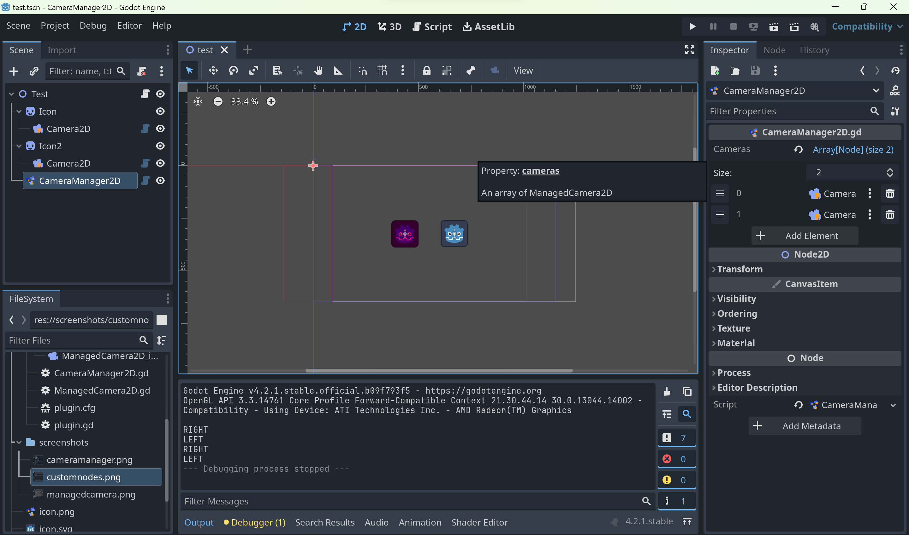
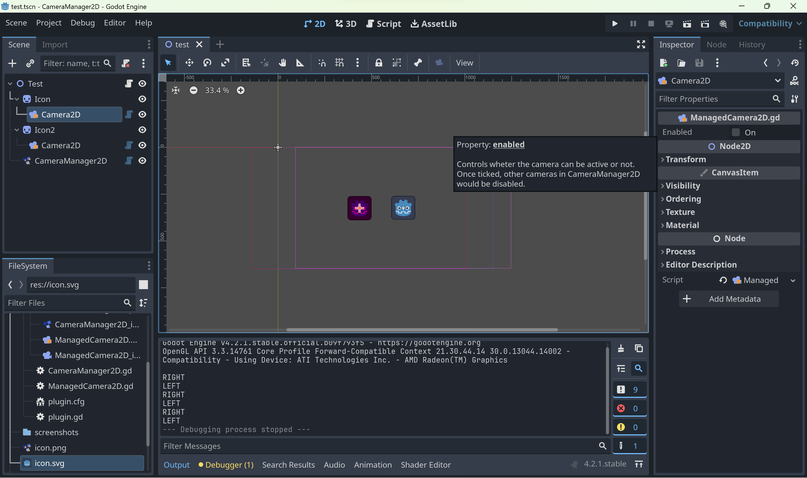
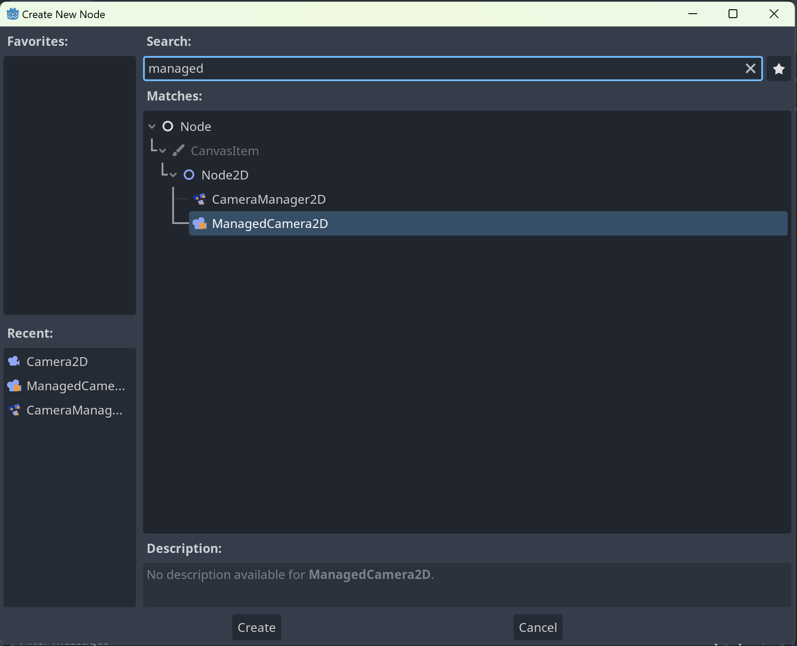
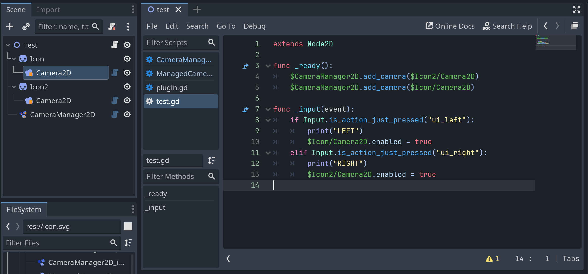

# CameraManager2D
Manage switching between multiple Camera2Ds

## Usage
1. Replace `Camera2D` with our `ManagedCamera2D`
2. Add `CameraManager2D` to your scene
3. Add your cameras to the `CameraManager2D`
4. Use `ManagedCamera2D.enabled` just like how you use `Camera2D.enable`

## Screenshots
| | |
| -- | -- |
 
Camera manager in Editor
 |  
Managed camera in Editor

 
Custom nodes added by addon
 |  
Camera manager in GDScript

## API
### CameraManager2D
| Property | Type | Description |
| -- | -- | -- |
cameras | `Array[ManagedCamera2D]` | 

#### `add_camera(camera: ManagedCamera2D) -> int`
Add your camera to the manager. Returns the camera index in `cameras` array.

#### `get_camera(index: int) -> ManagedCamera2D`
Get your camera from the manager.

#### `remove_camera(index: int)`
Remove your camera from the manager.

---

### ManagedCamera2D
| Property | Type | Description |
| -- | -- | -- |
enabled | `bool` | Controls wheter the camera can be active or not. Once ticked, other cameras in CameraManager2D would be disabled.
cam | `Camera2D` | Raw `Camera2D`